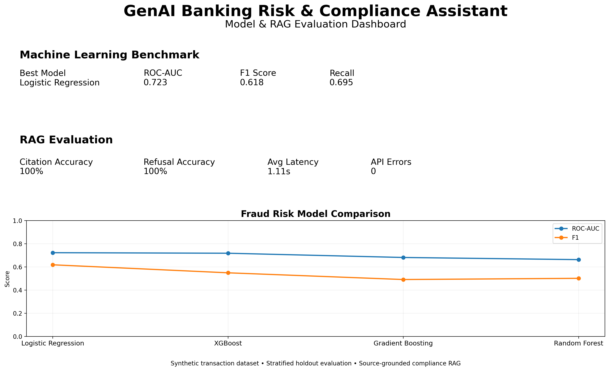
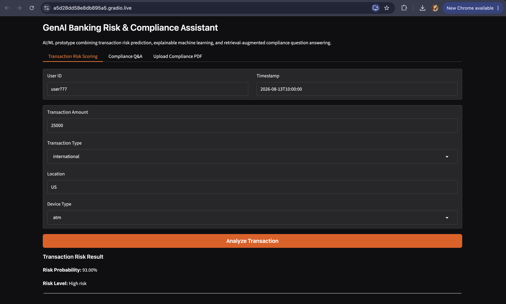
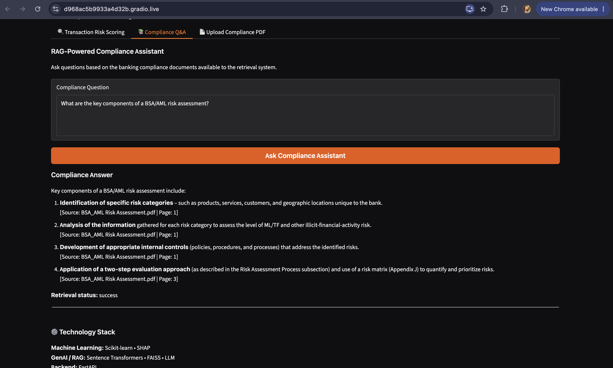
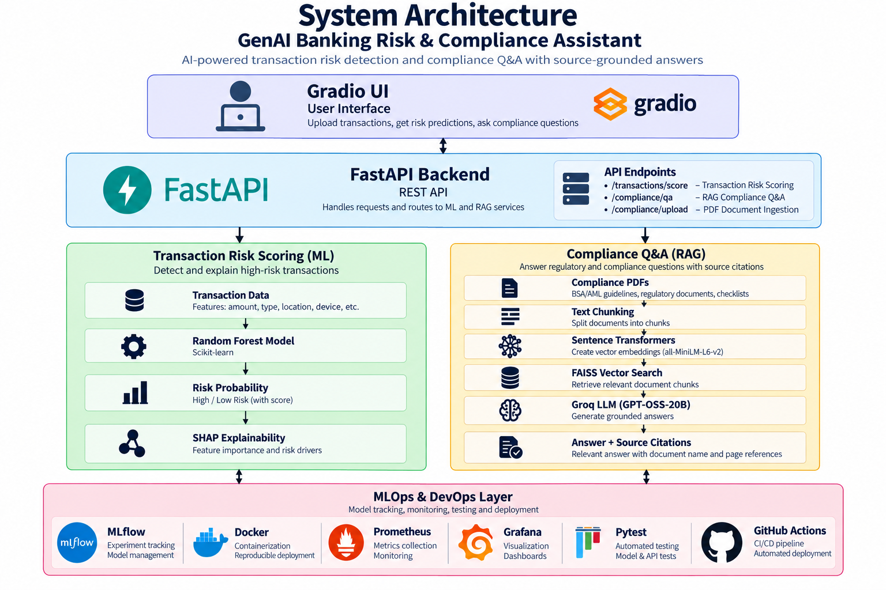

# GenAI Banking Risk & Compliance Assistant


An end-to-end AI/ML research prototype combining **machine learning, explainable AI, and Retrieval-Augmented Generation (RAG)** for banking transaction risk analysis and compliance question answering.

## Evaluation Highlights



### Evaluation Snapshot

| Metric | Result |
|---|---:|
| Best ROC-AUC | **0.723** |
| Best F1 Score | **0.618** |
| Best Recall | **0.695** |
| RAG Citation Behavior Accuracy | **100%** |
| RAG Refusal Behavior Accuracy | **100%** |
| Average RAG Generation Latency | **1.11 sec** |
| RAG Evaluation API Errors | **0** |

> **Research prototype:** The transaction dataset used in the current experiments is synthetically generated. Results should not be interpreted as production banking performance.

---

## Application Demo

### Transaction Risk Scoring

The transaction-risk interface evaluates transaction attributes and returns a model-generated risk probability and classification.



### RAG-Powered Compliance Assistant

The compliance assistant retrieves relevant evidence from indexed banking documents and generates grounded responses with page-level source citations.



---

## Project Overview

The project explores two related banking AI problems:

1. **Transaction Risk Analysis** — identifying potentially fraudulent transactions using supervised machine learning.
2. **Compliance Question Answering** — retrieving relevant evidence from banking compliance documents and generating context-grounded answers using an LLM.

The goal is to demonstrate how traditional machine learning, explainable AI, semantic retrieval, and generative AI can be integrated into a single research-oriented banking intelligence system.

---

## Research Questions

This project investigates:

- How effectively can machine learning models identify high-risk transactions?
- How do different classification algorithms compare on the same transaction dataset?
- Why can accuracy be misleading when evaluating fraud detection systems?
- How does classification-threshold selection affect precision and recall?
- Which transaction features contribute to model predictions?
- Can SHAP improve interpretability of transaction-risk predictions?
- Can RAG generate compliance answers grounded in retrieved policy documents?
- How accurately can the RAG system cite its retrieved evidence?
- Can the assistant appropriately refuse questions unsupported by the indexed documents?
- How can retrieval quality, source correctness, groundedness, and faithfulness be evaluated?

---

# System Architecture



The architecture combines two primary AI workflows.

## Transaction Risk Pipeline

```text
Transaction
    ↓
Feature preprocessing
    ↓
ML classifier
    ↓
Fraud probability
    ↓
Decision threshold
    ↓
Risk classification
    ↓
SHAP explanation
```

## Compliance RAG Pipeline

```text
Compliance PDFs
      ↓
PDF text extraction
      ↓
Recursive text chunking
      ↓
SentenceTransformer embeddings
      ↓
FAISS vector index
      ↓
User question
      ↓
Semantic retrieval
      ↓
Relevant document context
      ↓
Groq-hosted LLM
      ↓
Grounded answer
      ↓
Page-level source citations
```

---

# Key Features

## Transaction Risk Scoring

FastAPI exposes the transaction-risk endpoint:

```text
POST /transactions/score
```

The model processes transaction attributes including:

- Transaction amount
- Transaction type
- Location
- Device type
- Timestamp

and returns a fraud-risk probability and risk classification.

---

## Explainable AI

The project includes SHAP-based prediction explainability.

SHAP values provide feature-level attribution to help investigate:

- Why a transaction received a particular risk score
- Which features contributed most strongly
- Whether transaction amount influenced the prediction
- Whether transaction type, location, or device type increased predicted risk

The current API exposes:

```text
POST /explanations/fraud
```

---

## Compliance Question Answering

The compliance RAG endpoint is:

```text
POST /compliance/qa
```

The system:

1. Embeds the user question
2. Searches the FAISS vector index
3. Retrieves semantically relevant compliance-document chunks
4. Supplies retrieved evidence to the LLM
5. Generates an answer constrained by the retrieved context
6. Returns page-level source citations

---

## Dynamic PDF Indexing

New compliance documents can be uploaded through:

```text
POST /compliance/upload
```

Uploaded PDFs are:

1. Parsed using `pdfplumber`
2. Split into overlapping text chunks
3. Embedded using Sentence Transformers
4. Added to the FAISS vector index
5. Made available for subsequent compliance retrieval

---

# Tech Stack

| Component | Technology |
|---|---|
| Programming | Python |
| Backend | FastAPI, Uvicorn |
| Frontend | Gradio |
| Machine Learning | Scikit-learn |
| Model Comparison | Logistic Regression, Random Forest, Gradient Boosting, XGBoost |
| Explainability | SHAP |
| Embeddings | Sentence Transformers |
| Embedding Model | `all-MiniLM-L6-v2` |
| Vector Search | FAISS |
| Document Processing | pdfplumber |
| Text Splitting | LangChain RecursiveCharacterTextSplitter |
| Generative AI | Groq-hosted LLM |
| Experiment Tracking | MLflow |
| Monitoring | Prometheus, Grafana |
| Deployment | Docker, Docker Compose |
| Testing | Pytest |
| CI | GitHub Actions |

---

# Machine Learning Experiments

## Dataset

The current experiments use a **synthetically generated transaction dataset** containing features such as:

- Amount
- Transaction type
- Location
- Device type
- Fraud label

The synthetic dataset allows the complete ML pipeline to be demonstrated without exposing real financial or personally identifiable information.

---

## Baseline Model Comparison

Four classification algorithms were evaluated using the same **stratified 80/20 train-test split**.

| Model | Accuracy | Precision | Recall | F1 | ROC-AUC |
|---|---:|---:|---:|---:|---:|
| **Logistic Regression** | 0.670 | 0.557 | **0.695** | **0.618** | **0.723** |
| XGBoost | **0.680** | **0.600** | 0.506 | 0.549 | 0.718 |
| Gradient Boosting | 0.633 | 0.526 | 0.461 | 0.491 | 0.682 |
| Random Forest | 0.628 | 0.517 | 0.487 | 0.502 | 0.663 |

### Key Finding

Logistic Regression achieved the strongest baseline performance when prioritizing:

- ROC-AUC
- Fraud-class recall
- F1-score

Although XGBoost achieved slightly higher overall accuracy and precision, Logistic Regression detected a substantially larger proportion of fraud cases.

This experiment demonstrates that **increased model complexity does not automatically produce better performance**.

It also illustrates why accuracy alone can be misleading in fraud-detection problems.

---

# Classification Threshold Analysis

The Logistic Regression model was evaluated across multiple classification thresholds.

| Threshold | Precision | Recall | F1-score |
|---:|---:|---:|---:|
| 0.20 | 0.407 | 0.994 | 0.577 |
| 0.30 | 0.450 | 0.974 | 0.616 |
| **0.40** | **0.500** | **0.831** | **0.624** |
| 0.50 | 0.557 | 0.695 | 0.618 |
| 0.60 | 0.591 | 0.442 | 0.506 |
| 0.70 | 0.704 | 0.247 | 0.365 |

### Key Finding

Among the tested thresholds, **0.40 achieved the highest F1-score of 0.624**.

Lowering the threshold from the default `0.50` to `0.40` increased fraud recall from:

```text
69.5% → 83.1%
```

while precision decreased from:

```text
55.7% → 50.0%
```

This demonstrates the practical **precision-recall trade-off** involved in fraud screening.

A lower threshold identifies more potentially fraudulent transactions but also produces more false-positive alerts.

A production system would require threshold selection using independent validation data and business-specific costs associated with false positives and false negatives.

---

# Explainability

SHAP is used to examine how individual transaction features influence model predictions.

The explainability component is designed to help answer questions such as:

- Why was this transaction considered risky?
- Which features contributed most strongly to the prediction?
- Did transaction amount significantly affect the score?
- Did transaction type influence the result?
- Did location or device type increase predicted risk?

Explainability is particularly important for financial AI systems where model decisions may require investigation and human review.

---

# Retrieval-Augmented Generation

The compliance assistant uses **Retrieval-Augmented Generation (RAG)** to ground LLM responses in indexed compliance documents.

## Document Processing

```text
PDF
 ↓
pdfplumber
 ↓
Recursive text splitting
 ↓
SentenceTransformer embeddings
 ↓
FAISS vector index
```

The current embedding model is:

```text
all-MiniLM-L6-v2
```

---

## Semantic Retrieval

For each compliance question:

1. The question is converted into an embedding.
2. FAISS searches for semantically similar document chunks.
3. The most relevant chunks are retrieved.
4. Retrieved evidence is supplied to the LLM.
5. The LLM is instructed to answer only using the supplied context.
6. Source filenames and page numbers are included in the response.

This architecture is designed to reduce unsupported generation and improve answer grounding.

---

# RAG Evaluation

## Retrieval Evaluation

The retrieval component was evaluated using a small manually labeled set of **15 compliance questions across three source documents**.

| Metric | Result |
|---|---:|
| Recall@1 | **0.867** |
| Recall@3 | **1.000** |
| Recall@5 | **1.000** |
| Average Retrieval Latency | **0.0178 sec** |

For **13 of the 15 questions**, the expected source document was ranked first.

For the remaining two questions, the expected source was still retrieved within the top three results.

The errors primarily occurred for questions whose terminology overlapped across multiple compliance documents, demonstrating that document-level retrieval can remain ambiguous even when relevant evidence is available.

---

## Generated Answer Evaluation

The generated-answer evaluation tests:

- Citation behavior
- Expected source presence
- Valid page citations
- Appropriate refusal behavior
- Generation latency
- API errors

Current evaluation results:

| Metric | Result |
|---|---:|
| Citation Behavior Accuracy | **100%** |
| Refusal Behavior Accuracy | **100%** |
| Average Generation Latency | **~1.11 sec** |
| API Errors | **0** |

The refusal test intentionally asks a question whose answer is not available in the indexed compliance documents.

The assistant correctly responds that the retrieved documents do not contain enough information rather than generating an unsupported answer.

> These results are based on a small prototype evaluation set and should not be interpreted as comprehensive evidence of production-level compliance reliability.

---

# Reproducible Evaluation

Evaluation scripts are available under:

```text
evaluation/
```

## Fraud Model Evaluation

```bash
python evaluation/evaluate_fraud_model.py
```

Evaluates:

- Accuracy
- Precision
- Recall
- F1-score
- ROC-AUC
- Classification report
- Confusion matrix
- ROC curve

---

## Model Comparison

```bash
python evaluation/compare_models.py
```

Compares:

- Logistic Regression
- Random Forest
- Gradient Boosting
- XGBoost

---

## Threshold Analysis

```bash
python evaluation/threshold_analysis.py
```

Measures precision, recall, and F1-score across multiple decision thresholds.

---

## Retrieval Evaluation

```bash
python evaluation/evaluate_rag.py
```

Evaluates retrieval behavior including Recall@K and retrieval latency.

---

## RAG Answer Evaluation

```bash
python evaluation/evaluate_rag_answers.py
```

Evaluates generated answers for citation and refusal behavior.

---

# Evaluation Artifacts

Generated experiment outputs are stored under:

```text
docs/results/
```

Examples include:

```text
confusion_matrix.png
fraud_model_metrics.md
linkedin_evaluation_dashboard.png
model_comparison.csv
rag_answer_evaluation.csv
roc_curve.png
threshold_analysis.csv
```

---

# API Endpoints

| Endpoint | Method | Purpose |
|---|---|---|
| `/` | GET | Application health/root endpoint |
| `/transactions/score` | POST | Transaction risk scoring |
| `/explanations/fraud` | POST | SHAP-based prediction explanation |
| `/compliance/qa` | POST | Compliance RAG question answering |
| `/compliance/upload` | POST | Upload and index a compliance PDF |
| `/metrics` | GET | Prometheus application metrics |

---

# Gradio Interface

The project includes a Gradio interface for interacting with the backend.

Start the FastAPI backend:

```bash
uvicorn main:app --reload
```

Then launch Gradio:

```bash
python gradio_ui.py
```

The interface provides:

- Transaction risk scoring
- Compliance question answering
- Compliance PDF upload and indexing

---

# Testing & Continuous Integration

The project uses **Pytest** for automated testing and **GitHub Actions** for continuous integration.

The CI workflow runs automatically on pushes and pull requests to the `main` branch.

```text
Code checkout
     ↓
Python environment
     ↓
Dependency installation
     ↓
Flake8 validation
     ↓
Pytest
```

The CI badge at the top of the README reflects the current workflow status.

---

# Experiment Tracking

ML experiments are tracked using **MLflow**.

The training workflow records model parameters and evaluation metrics using a local SQLite tracking backend:

```text
sqlite:///mlflow.db
```

This makes the experiment-tracking configuration portable across local and notebook environments.

---

# Monitoring

FastAPI application metrics are instrumented using:

```text
prometheus-fastapi-instrumentator
```

The project also contains Prometheus and Grafana components for observability experiments.

---

# Containerization

The project includes Docker and Docker Compose components for local containerized execution.

This provides a foundation for:

- Reproducible environments
- Application containerization
- Monitoring services
- Future deployment experiments

---

# Limitations

This repository is an **AI/ML research and engineering prototype**.

Important limitations include:

- Transaction data is synthetically generated.
- Model performance does not represent real banking fraud performance.
- The current transaction dataset is relatively small.
- RAG evaluation uses a limited benchmark.
- Citation accuracy was measured on a small evaluation set.
- Compliance answers should not be treated as legal or regulatory advice.
- Real-world deployment would require stronger security, governance, validation, monitoring, access control, and human oversight.

---

# Future Research

Future work includes:

- Larger labeled compliance QA benchmark
- Chunk-level retrieval evaluation
- Groundedness and faithfulness evaluation
- RAG vs. no-RAG experiments
- Embedding-model comparison
- Chunk-size and overlap experiments
- Retrieval reranking
- Hyperparameter optimization
- Probability calibration
- Cost-sensitive fraud classification
- Cross-validation
- Model drift monitoring
- Human-in-the-loop compliance review
- Evaluation on appropriately governed real-world datasets

---

# Project Structure

```text
Genai-banking-risk-assistant/
│
├── Application/
│   ├── routes/
│   ├── services/
│   └── models/
│
├── Compliance_files/
│
├── Dataset/
│   ├── synthetic_data.py
│   └── transactions.csv
│
├── ML_Model/
│   └── fraud_detection.py
│
├── evaluation/
│   ├── evaluate_fraud_model.py
│   ├── compare_models.py
│   ├── threshold_analysis.py
│   ├── evaluate_rag.py
│   └── evaluate_rag_answers.py
│
├── docs/
│   ├── system-architecture.png
│   ├── transaction-risk-demo.png
│   ├── compliance-rag-demo.png
│   └── results/
│
├── .github/
│   └── workflows/
│
├── gradio_ui.py
├── main.py
├── model.pkl
├── requirements.txt
└── README.md
```

---

# Research Perspective

This project is designed not only as an application prototype but also as an experimental environment for studying the intersection of:

**Machine Learning + Explainable AI + Generative AI + Information Retrieval + Responsible AI**

The focus is on progressively evaluating individual system components rather than relying only on end-to-end demonstrations.

The project demonstrates an engineering workflow that moves from **model development → evaluation → explainability → retrieval → grounded generation → API integration → interactive application → reproducible experimentation**.
